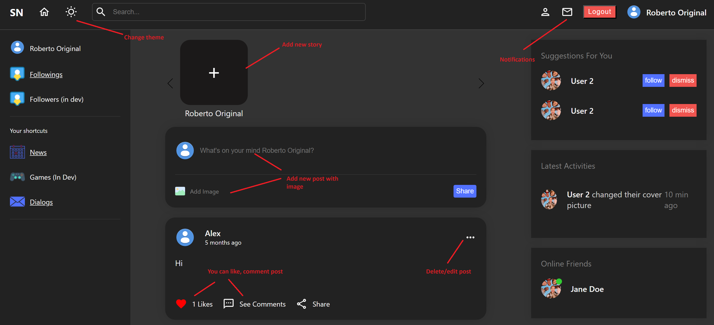
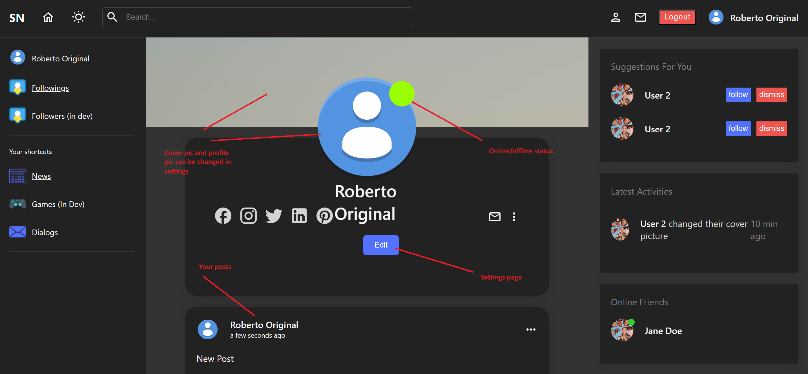
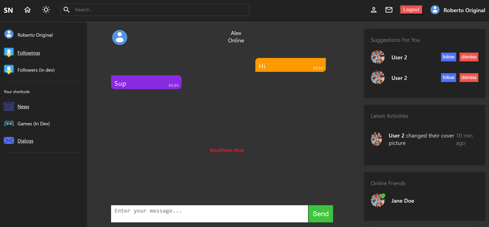

# Social Network (still in dev!)

1. Main Page
   

2. Profile
   

3. Chat
   

## Pages

- Login/Register
- Home page (news)
- Dialogs
- Chat
- Followings
- Profile page
- Settings
- Stories

## Functionality

- Login / Register
- Add post, like post, comment, delete, edit
- Edit your profile info
- Upload Stories
- RealTime chat
- Notifications
- Follow / Unfollow

## Technologies

- React.js, TypeScript, JavaScript, HTML, CSS, React-Query, JSON-Server, SASS, WebSocket, Node, Express, MySQL, multer, bcryptjs, axios, react-webcam.

## Project Setup

1. Clone the repository to your local machine.
2. Install dependencies using the command `npm install`.
3. Create db
4. Put your db info in connect.js
5. Start the server using the command `npm start`
6. Start the client using the command `npm start`
